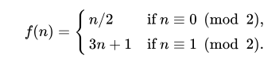

# Collatz Conjecture Graphicator

The objective of this exercise is to make a program that graphs each of the steps in the collatz conjecture until it hits the 4-2-1 loop.

The collatz conjecture is a mathematics problem that proposes that every single positive integer will transform into 1 by following a simple system of equations, which is the following:

The way I intended it to work is that I store in memory a list of numbers and in each tick it would graph a bar whose width is the canvas width divided by the amount of numbers in the list (in order to limit the width of the graph by the width of the canvas) and whose height is the number itself.

The challenge was in making a function that added a number to a list in DrRacket and position the shapes correctly in the canvas.

I thought about making this project while doing the chapter `4A - Self-Reference`, and got into making it as a way to rest between finishing the chapter and starting the next.